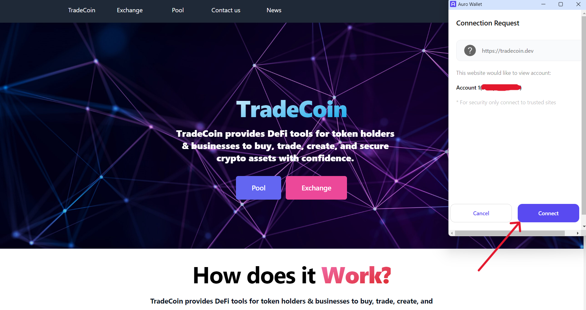
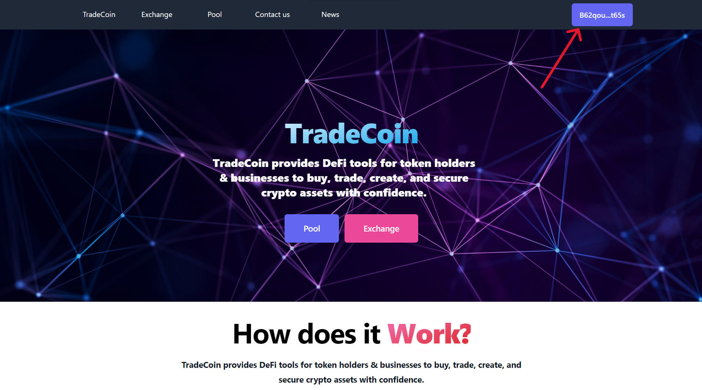
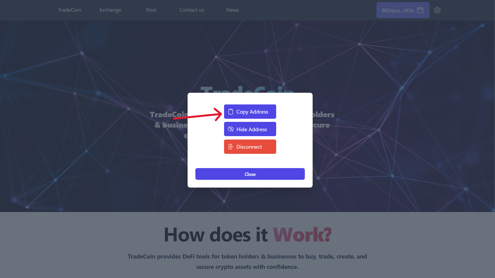
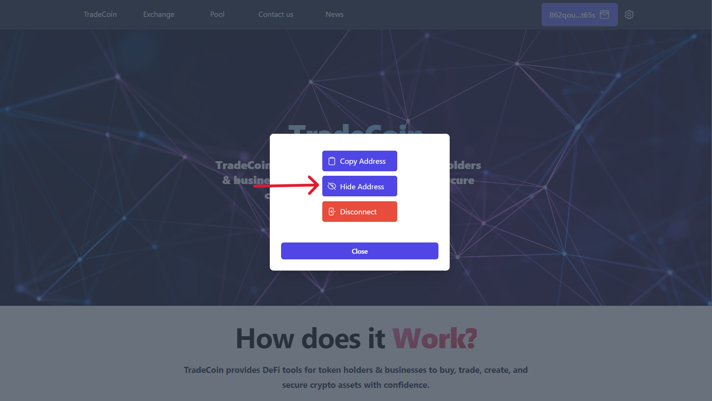
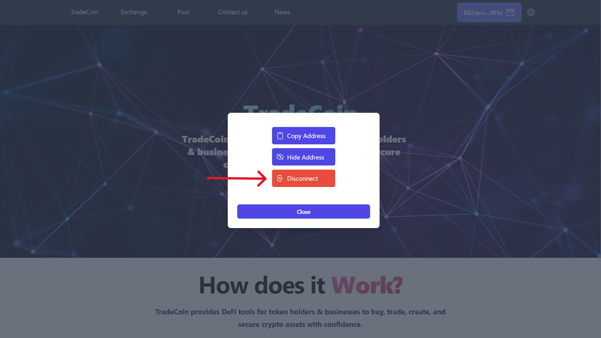

# User Guide For Connecting a Wallet

Welcome to the wallet connection page! Follow these simple steps to successfully connect your wallet

## 1. Connect Wallet

Click on the wallet connection button

## 2. Checking the profile

Check if the profile is selected correctly, then click the connect button

## 3. Done

Congratulations! You have connected your wallet

## Wallet Settings

Once you have successfully connected your wallet, you may want to adjust some settings to personalize your experience. Here's how you can manage your wallet settings

## 1. Copy Address

You can easily copy your wallet address to the clipboard by clicking the "Copy Address" button. This can be useful for sharing your address with others for transactions or verification purposes.

## 2. Toggle Address Visibility

If you wish to hide your wallet address from view, you can toggle the address visibility using the "Show/Hide Address" button. This feature can help enhance privacy when you don't want your address to be visible on the screen.

## 3. Disconnect Wallet

If you want to disconnect your wallet from the application, you can do so by clicking the "Disconnect" button. This action will remove your wallet information from the application.

# Conclusion

That's all! You have successfully connected your wallet to Trade Coin. If you have any problems or have any questions, do not hesitate to contact us via the page "[Contact Us](./howdoesitwork/contact-us-page.md)".
