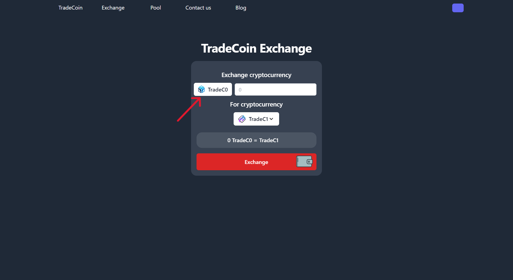
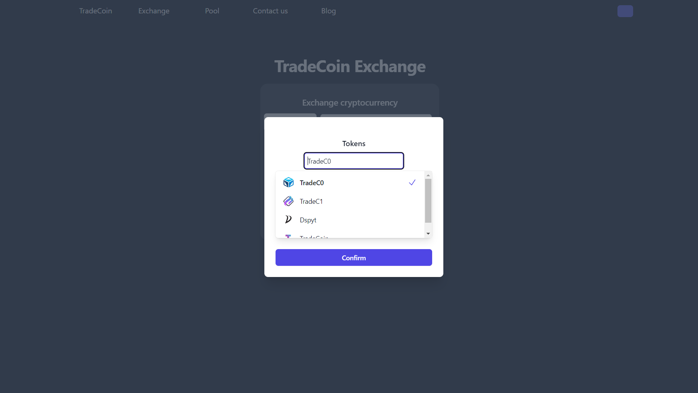
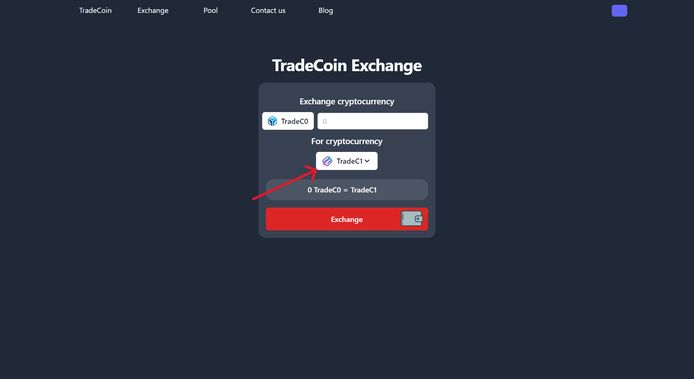
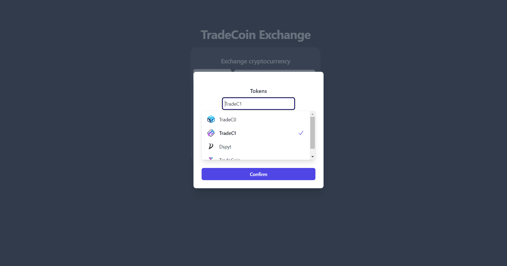
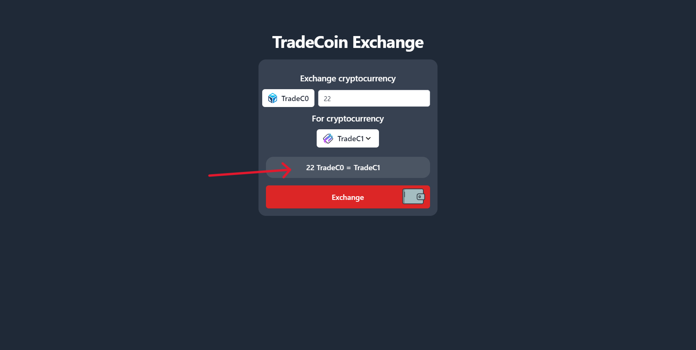
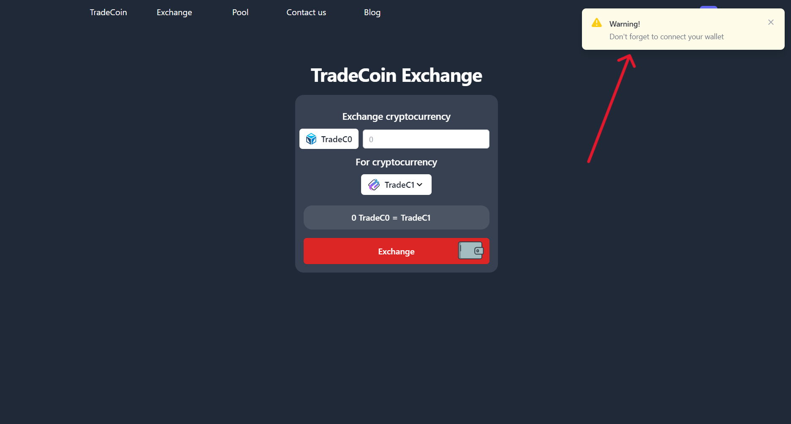
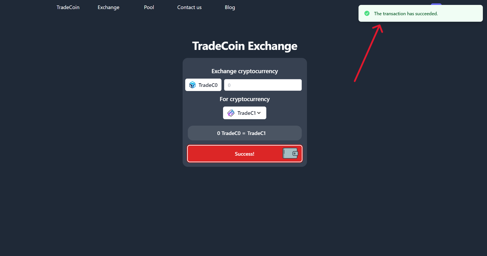

# TradeCoin Exchange Page User Guide

Welcome to the TradeCoin Exchange page, where you can effortlessly trade cryptocurrencies. Follow these simple steps to complete your trades successfully.

## 1. Overview

Upon entering the Exchange page, you'll encounter an easy-to-use interface designed for a seamless trading experience.

## 2. Selecting Cryptocurrencies

### 2.1 Choose Token A

Click the "Choose Token A" button to pick the cryptocurrency you want to trade.

### 2.2 Choose Token B

Similarly, click the "Choose Token B" button to select the cryptocurrency you wish to receive.

## 3. Transaction Status

Enter the amount you want to exchange in the provided field. The system will display the equivalent amount of Token B based on the current exchange rate.

## 4. User Warnings

Pay attention to warnings, especially reminders about the need to connect a wallet.

## 5. Execute the Swap

Click the "Exchange" button to initiate the swap. A loading spinner will appear during the transaction. Once completed, you'll receive a success message.

# Conclusion

That's it! You've successfully completed a cryptocurrency swap on TradeCoin. If you encounter any issues or have questions, feel free to reach out to us through the "Contact Us" page. Happy trading!
