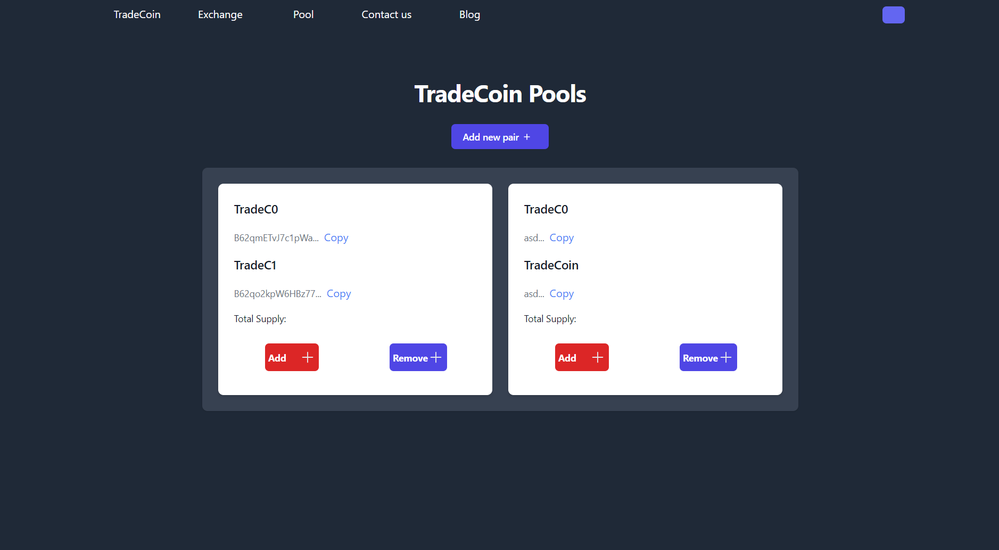
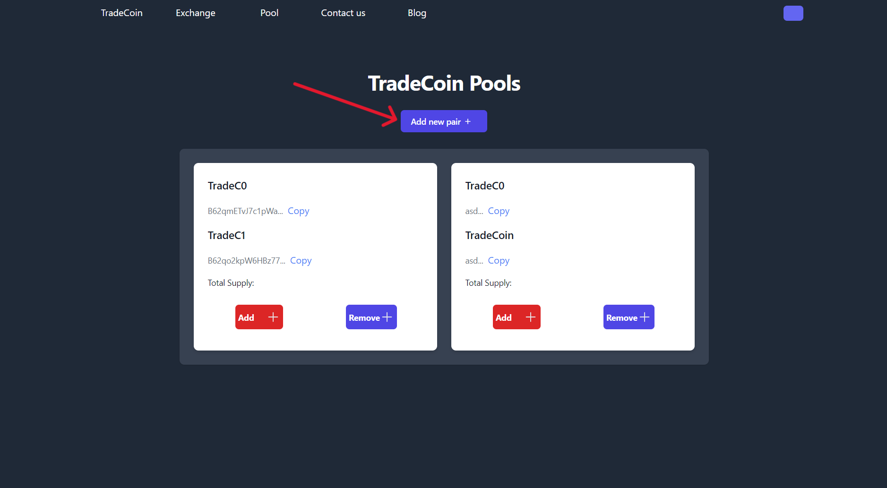
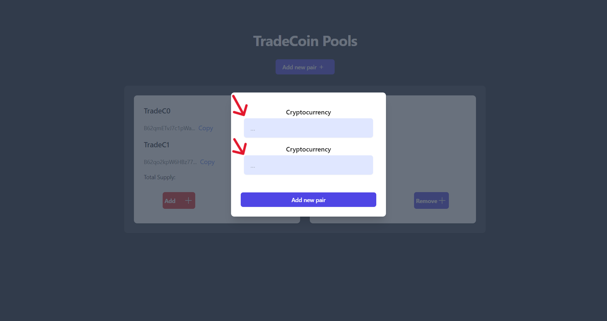
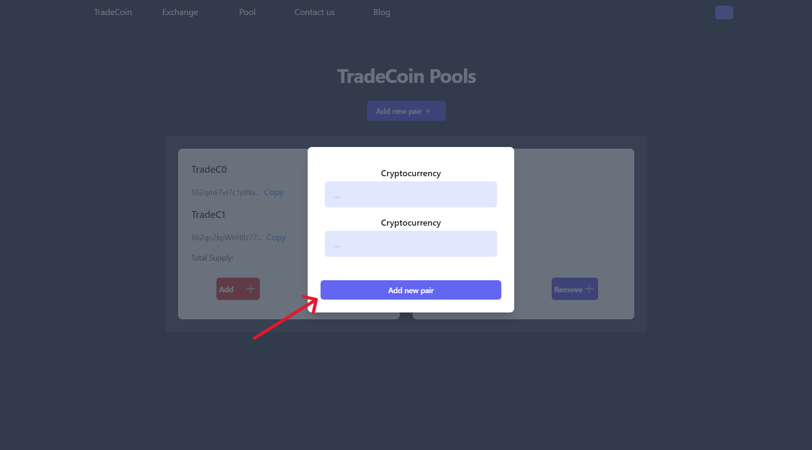
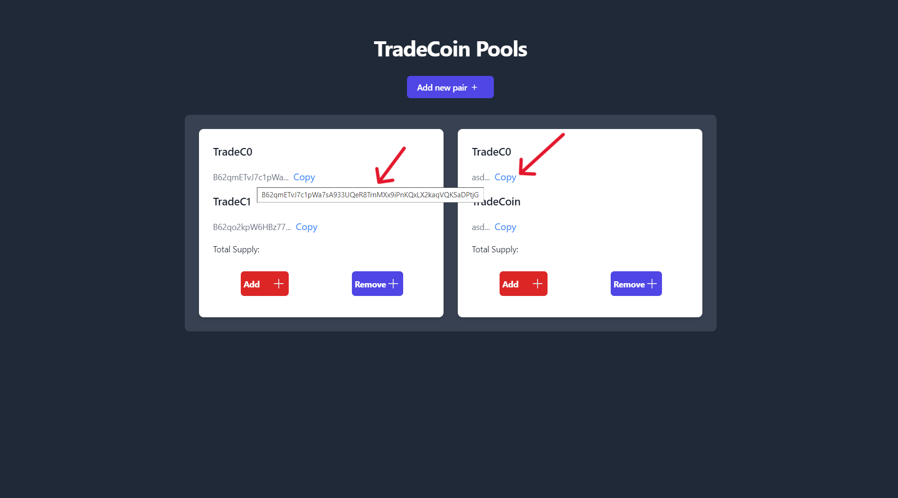
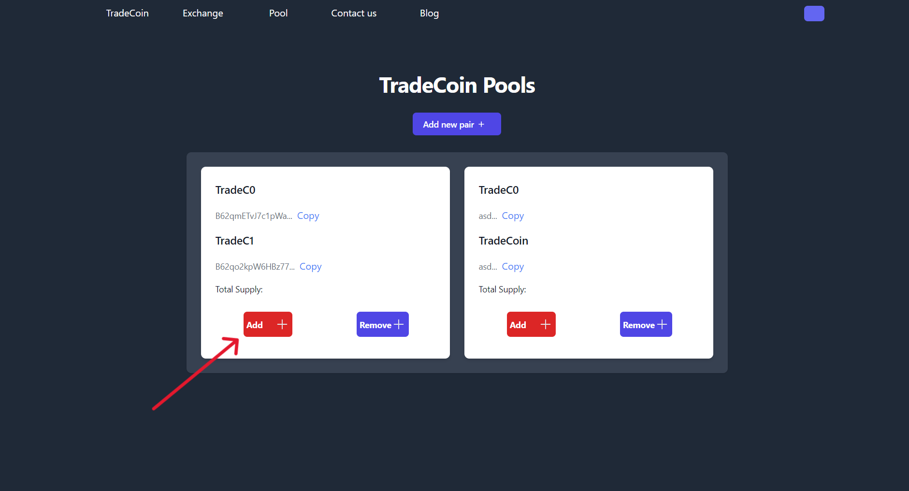
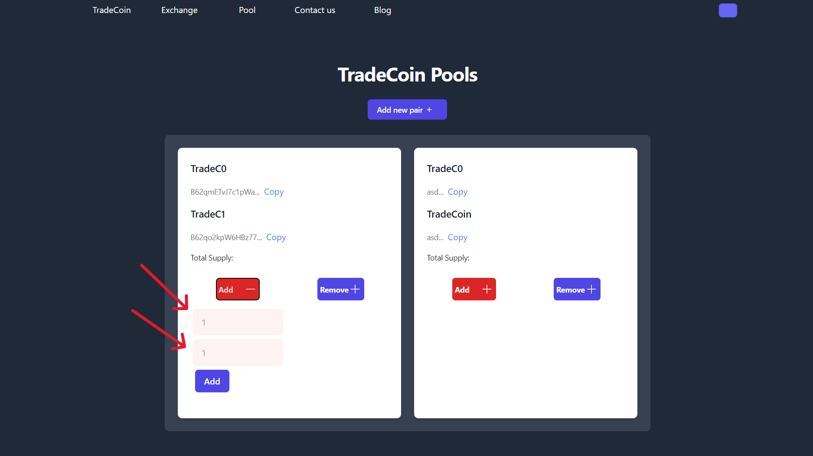
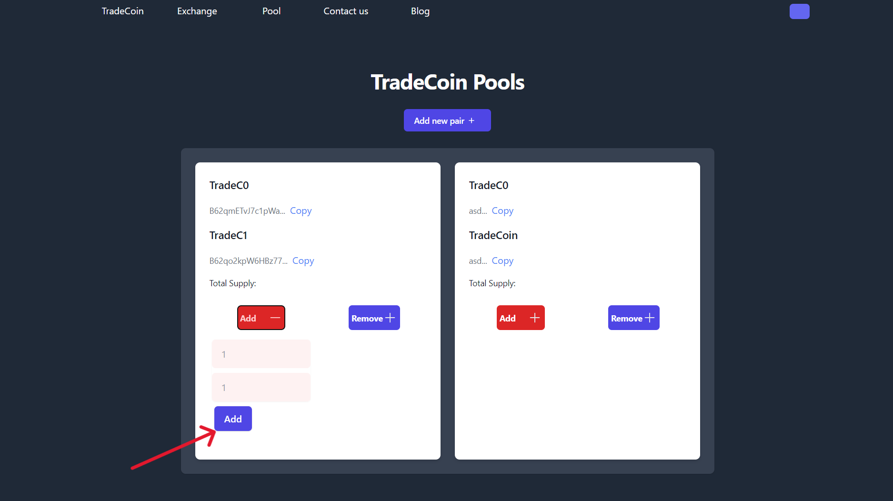
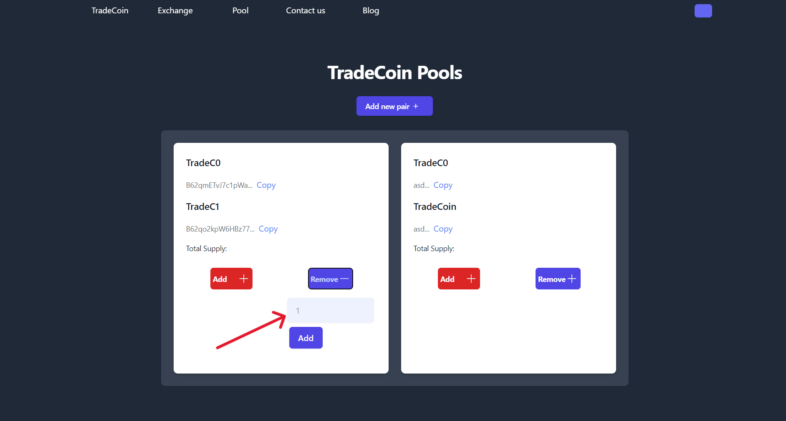
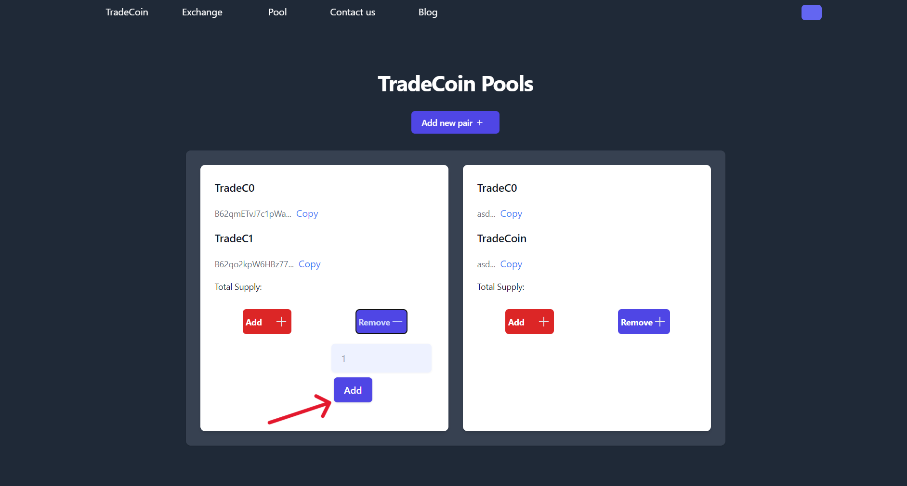

# TradeCoin Pools Page User Guide

Welcome to the TradeCoin Pools page, your gateway to managing cryptocurrency pools effortlessly. Follow these simple steps to make the most out of your liquidity operations.

## 1. Overview

Upon entering the Pools page, you'll find an intuitive interface tailored for a smooth experience in handling cryptocurrency pairs.

## 2. Adding a New Pair

### 2.1 Add New Pair

Click the "Add new pair" button to introduce a new cryptocurrency pair to the platform.

### 2.2 Enter Cryptocurrency Details

- Enter the details of both cryptocurrencies you want to pair.

- Confirm your selection to add the new pair.

## 3. Exploring Pools

Explore existing pools to view cryptocurrency pair details, including names, addresses, and total supply.

- Click "Copy" to copy cryptocurrency addresses.
- Hover over the mouse to view the full addresses of cryptocurrencies.

## 4. Liquidity Operations

Perform liquidity operations with ease.

### 4.1 Add Liquidity

- Click the "Add" button next to your desired pool.

  

- Enter the quantity of each cryptocurrency you want to add.

  

- Confirm your action to add liquidity.

  

### 4.2 Remove Liquidity

- Click the "Remove" button next to your desired pool.

- Enter the withdrawal quantity.

- Confirm your action to remove liquidity.

# Conclusion

Feel free to explore the TradeCoin Pools page, and if you have any questions or encounter issues, don't hesitate to reach out through the "Contact Us" page. Happy trading!
