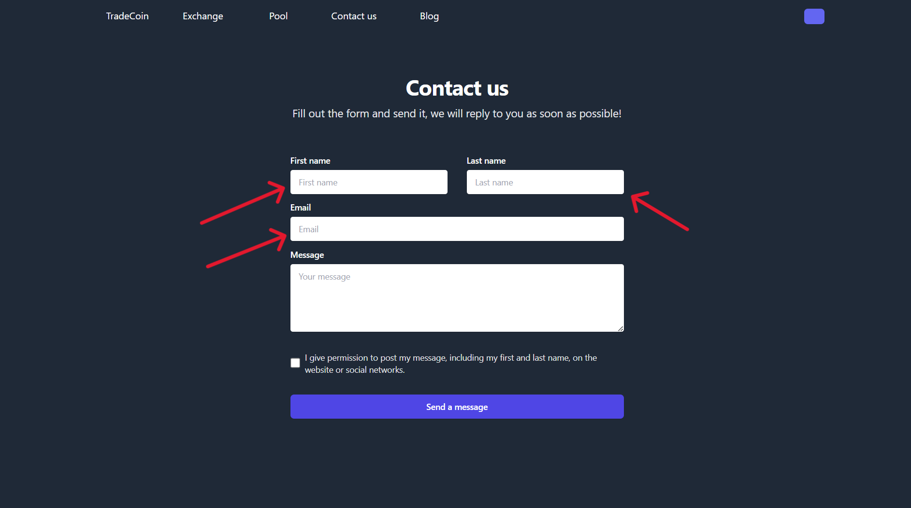
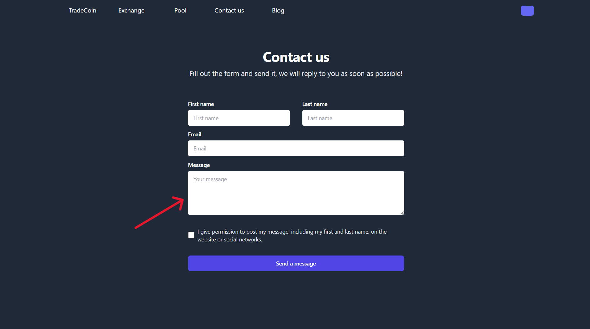
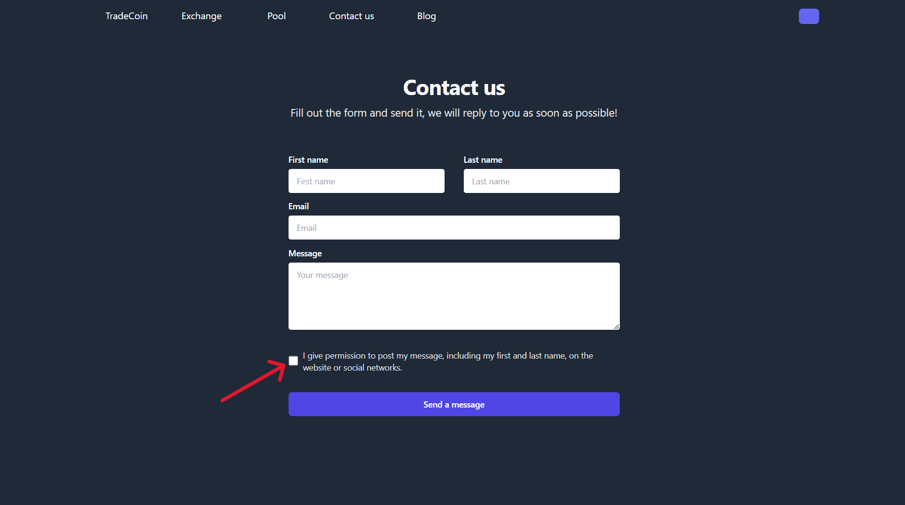
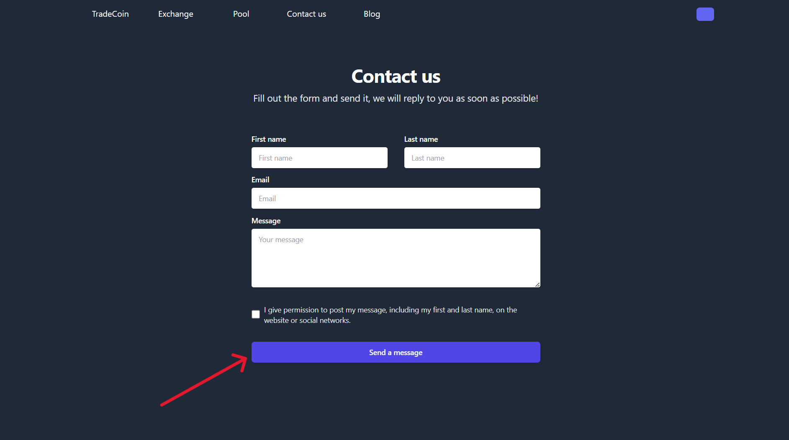

# Contact Us Form User Guide

Welcome to the TradeCoin Contact Us form, your portal to get in touch with us effortlessly. Follow these simple steps to reach out and send us your messages.

## 1. Overview

The Contact Us form allows you to send messages or inquiries to our team. We value your feedback and are here to assist you.

## 2. Fill Out the Form

### 2.1 Enter Your Details

Provide your name, email, and last name in the corresponding fields.

### 2.2 Craft Your Message

Compose your message in the "Message" field, letting us know the details or inquiries you have.

### 2.3 Agreement Checkbox

Tick the checkbox if you agree to allow us to post your message, including your first and last name, on our website or social networks.

## 3. Submitting Your Message

Click the "Send a message" button to submit your message. Please ensure you have agreed to the publication terms.

## 4. Confirmation Page

Upon successful submission, you'll be redirected to a confirmation page. Here, you'll find a thank-you message and a confirmation of your message being sent.

# Conclusion

Feel free to use the Contact Us form, and if you have any questions or issues, don't hesitate to reach out through alternative contact methods. We appreciate your communication.
